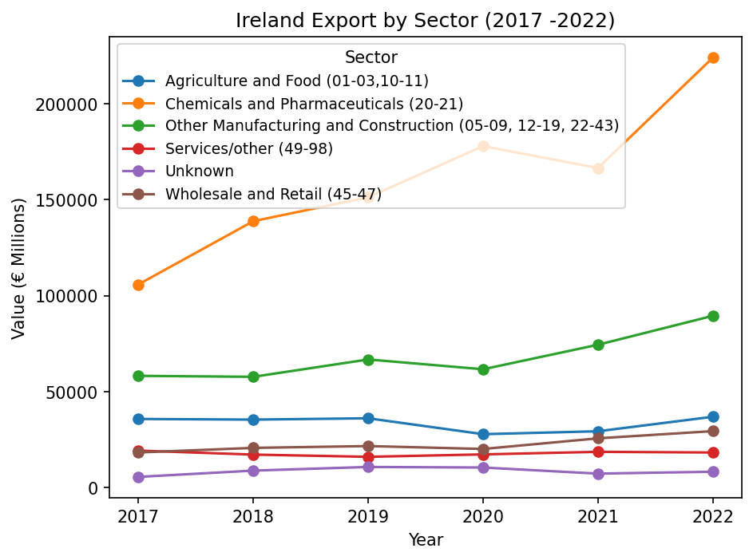

# Ireland-data-trade-analysis
Analysis of Ireland export trends by sector (2017-2022) using CSO open data

Ireland Export Trends by Sector (2017–2022)

A Python data analysis project exploring how Ireland's export values have changed across key industry sectors between 2017 and 2022, using official government trade statistics.

Key Finding

Chemicals and Pharmaceuticals exports more than doubled over the period, rising from €105,941 million in 2017 to €224,046 million in 2022 — by far the fastest-growing sector. In contrast, sectors like Agriculture and Services/Other remained relatively flat across the same period.

Data Source

Central Statistics Office (CSO) Ireland — TSA11: Exports and Imports, published via data.gov.ie.
Licensed under Creative Commons Attribution 4.0.

What This Project Does

Loads and cleans raw CSO trade data using pandas
Filters out summary/rollup rows to avoid double-counting
Groups export values by sector and year
Identifies the top-performing sector by total export value
Visualizes multi-year trends using matplotlib

Tools Used

Python, pandas, matplotlib

Files

track.py — main analysis script
TSA11.20260713220302.csv — raw source data (CSO)
exports_by_sector.png — output chart

How to Run

pip install pandas matplotlib
python3 track.py